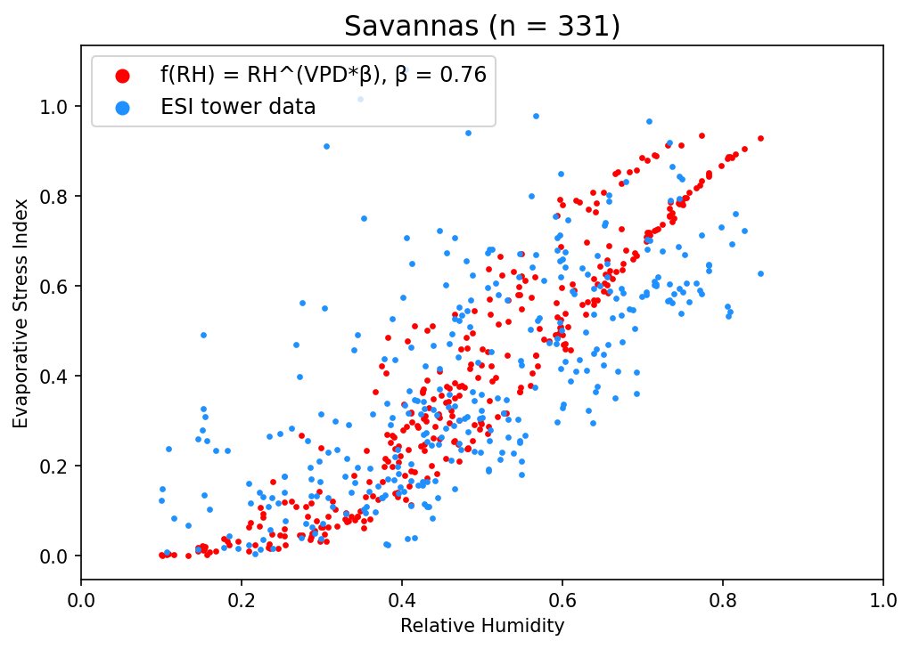

# Atmospheric Humidity Deficits Tell Us About How Soil Moisture Deficits Down-Regulate Ecosystem Evaporation
Python code repository for wrangling and performing analyses with [FLUXNET](https://fluxnet.org/) 2015 eddy covariance data to better understand the relationship between vegetation-atmosphere interactions and soil moisture. This code supplements Baldocchi et al. (2021); see citation below. Code written by Nicole Keeney and Dennis Baldocchi @ UC Berkeley.

## Running the code locally
To run these notebooks, you'll need the standard set of python data science modules, including pandas, numpy, matplotlib, scipy, and sklearn. You'll also need to download the FLUXNET 2015 data, which is publically available at the link above. 

## Related Paper 
Dennis D. Baldocchi, Nicole Keeney, Camilo Rey-Sanchez, Joshua B. Fisher, Atmospheric Humidity Deficits Tell Us How Soil Moisture Deficits Down-Regulate Ecosystem Evaporation, Advances in Water Resources, 2021, 104100, ISSN 0309-1708, https://doi.org/10.1016/j.advwatres.2021.104100.
